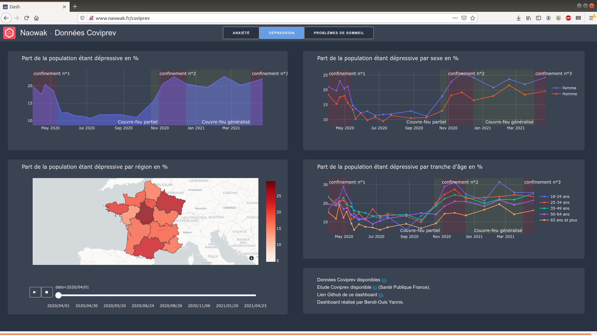

# Coviprev

Ce projet a pour but de visualiser les données Coviprev extraitent par l'équipe PsyCovid lors du Hackathon Covid19 qui a eu lieu le 23 et 24 avril 2021.



# Installation
Pour cloner le dépôt
```bash
git clone https://github.com/Naowak/Coviprev
cd Coviprev
```
Pour faciliter l'installation, nous pouvons créer un environnement virtual avec virtualenv (Version 3.6, 3.7 et 3.8 de python compatibles), l'activer, et procéder à l'installation des dépendances avec pip
```bash
virtualenv venv
source venv/bin/activate
pip install -r requirements.txt
```
Vous pouvez maintenant lancer l'interface
```bash
python main.py
```
Et y accèder sur votre navigateur web via l'adresse
```
http://127.0.0.1:8050/
```

# Références
Ces données peuvent être retrouvées brutes ici:  
https://www.data.gouv.fr/fr/datasets/donnees-denquete-relatives-a-levolution-des-comportements-et-de-la-sante-mentale-pendant-lepidemie-de-covid-19-coviprev/  

Le lien vers le projet github de l'équipe PsyCovid:  
https://github.com/babash/hackhathon_covid19  

Membre du groupe PsyCovid:
- BAKALARA Johanne, doctorante
- CONNES Victor, doctorant
- GUYET Thomas, enseignant-chercheur
- GUINCHARD Sarah, M2 Bio-informatique
- BUTON Nicolas, Doctorant
- HOMBOURGER Sophie, docteure en biologie/data analyst
- BENDI-OUIS Yannis, ingénieur
- LEDIEU Thibault, ingénieur
- DUQUESNES Camille, M2 Sciences Digitales
- BEN SLAMA Selim, M2 Sciences Digitales au Centre de Recherche Interdisciplinaires
- LE CUNFF, Yann, enseignant-chercheur


